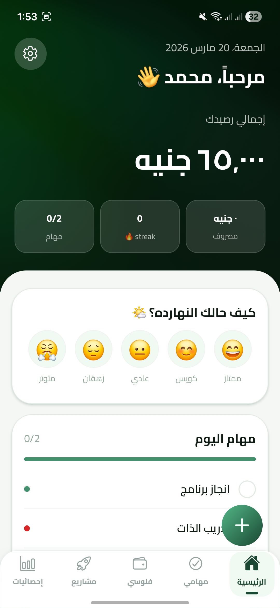
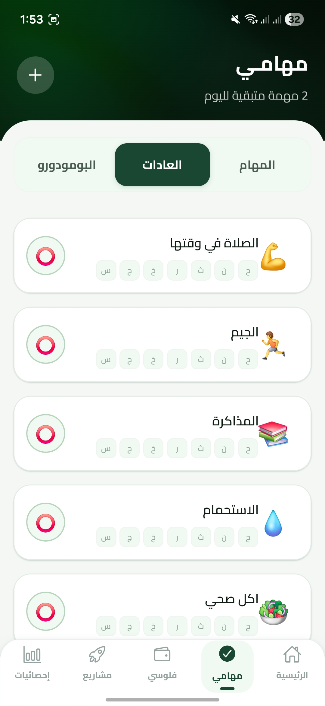
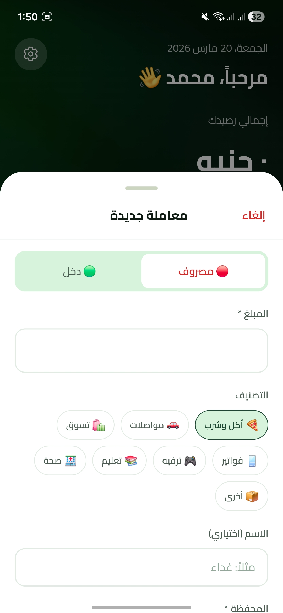

<div align="center">
<div align="center">
  
</div>

<br />
<pre>
███╗   ███╗██╗███████╗ █████╗ ███╗   ██╗
████╗ ████║██║╚══███╔╝██╔══██╗████╗  ██║
██╔████╔██║██║  ███╔╝ ███████║██╔██╗ ██║
██║╚██╔╝██║██║ ███╔╝  ██╔══██║██║╚██╗██║
██║ ╚═╝ ██║██║███████╗██║  ██║██║ ╚████║
╚═╝     ╚═╝╚═╝╚══════╝╚═╝  ╚═╝╚═╝  ╚═══╝
</pre>

# ميزان · Mizan

### نظّم يومك، مهامك، فلوسك، ومشاريعك في تطبيق عربي واحد
An Arabic-first productivity and finance companion for your daily life


[](https://github.com/m7amedenho)
[](https://www.linkedin.com/in/m7amedenho/)
[](https://www.instagram.com/m.7amedenho)

</div>

---

## 📱 معاينة التطبيق

| Dashboard | Tasks | Finance |
|:---:|:---:|:---:|
|  |  |  |

---

## ✨ المميزات

| القسم | التفاصيل |
|------|----------|
| 🏠 الداشبورد | لوحة تحكم ذكية تعرض ملخص يومك<br/>تحية شخصية وتاريخ بالعربي<br/>إجمالي الرصيد مع إمكانية الإخفاء<br/>Mood check-in يومي |
| ✅ المهام والعادات | إضافة مهام بأولويات وتصنيفات<br/>Sub-tasks جوه كل مهمة<br/>تتبع العادات اليومية مع Streak counter<br/>Pomodoro Timer للتركيز |
| 💰 إدارة الفلوس | محافظ متعددة (كاش / بنك / محفظة إلكترونية)<br/>تتبع المصروفات والدخل بتصنيفات<br/>إدارة الديون (ليك وعليك)<br/>ميزانية شهرية مع تحذيرات |
| 🚀 المشاريع | تتبع مشاريعك بخطوات واضحة<br/>Timer لكل خطوة<br/>بطاقة إنجاز عند الإكمال |
| 🎯 الأهداف والتحديات | أهداف طويلة المدى مع خطوات فرعية<br/>تحديات يومية مع progress tracking<br/>يوميات قصيرة (Journal) |
| 📊 الإحصائيات | تقارير مالية بالرسوم البيانية<br/>إحصائيات الإنتاجية<br/>Mood tracking chart |
| 📍 الموقع الجغرافي | تسجيل مكان المصروف<br/>تذكيرات بناءً على الموقع (Geofencing) |
| 🌐 تجربة عربية كاملة | واجهة RTL 100% بالعربي<br/>خط Cairo المحترف<br/>أرقام عربية |

---

## 🛠️ التقنيات المستخدمة

| التقنية | الاستخدام |
|---------|-----------|
| Expo SDK 55 | Mobile framework |
| React Native | UI components |
| TypeScript | Type safety |
| Expo Router | File-based navigation |
| Zustand | State management |
| MMKV | Local storage |
| expo-notifications | Push notifications |
| expo-location | Geofencing |
| react-native-gifted-charts | Data visualization |
| @gorhom/bottom-sheet | Bottom sheets |
| react-native-reanimated | Animations |
| date-fns (ar locale) | Arabic dates |
| Cairo Font | Arabic typography |

---

## 🚀 البداية السريعة

### Prerequisites

- Node.js 18+
- Expo CLI
- iOS Simulator or Android Emulator

### Installation

```bash
# Clone the repository
git clone https://github.com/m7amedenho/mizan.git

# Navigate to project
cd mizan

# Install dependencies
npm install

# Start development server
npx expo start

# Run on Android
npx expo run:android

# Run on iOS
npx expo run:ios
````

### Build for production

```bash
# Build for Android
npx eas build --platform android

# Build for iOS
npx eas build --platform ios
```

-----

## 📁 هيكل المشروع

```text
mizan/
├── app/
│   ├── (tabs)/               # Main tab screens
│   │   ├── index.tsx         # Dashboard
│   │   ├── tasks.tsx         # Tasks & Habits
│   │   ├── finance.tsx       # Finance tracker
│   │   ├── projects.tsx      # Projects
│   │   ├── goals.tsx         # Goals & Challenges
│   │   └── stats.tsx         # Statistics
│   ├── onboarding.tsx        # First launch
│   ├── settings.tsx          # Settings
│   └── _layout.tsx           # Root layout
├── components/
│   ├── ui/                   # Reusable components
│   ├── tasks/                # Task components
│   ├── finance/              # Finance components
│   ├── goals/                # Goal components
│   └── projects/             # Project components
├── stores/                   # Zustand state
├── utils/                    # Helpers
├── constants/                # Colors, categories, design tokens
├── types/                    # TypeScript types
├── assets/                   # Fonts and static assets
└── package.json              # Project metadata and scripts
```

-----

## 🤝 المساهمة

نرحّب جدًا بأي مساهمة تطور **ميزان** وتخليه مفيد أكثر للشباب العربي. سواء كانت Feature جديدة، تحسين في الأداء، أو polishing للواجهة، فمشاركتك محل تقدير.

1.  Fork the repo
2.  Create a feature branch: `git checkout -b feature/amazing-feature`
3.  Commit your changes: `git commit -m 'Add amazing feature'`
4.  Push your branch: `git push origin feature/amazing-feature`
5.  Open a Pull Request

**ملاحظة:** أي مساهمة في الـ UI يجب أن تحافظ على تجربة عربية RTL بشكل كامل.

-----

## 📜 الرخصة

هذا المشروع مرخص تحت رخصة **GNU General Public License v3.0**.

**ما يُسمح به:**

  - ✅ استخدام الكود لأغراض شخصية وتعليمية
  - ✅ تعديل الكود والبناء عليه
  - ✅ توزيع النسخ المعدلة أو الأصلية تحت نفس الرخصة GPL-3.0

**الشرط الأساسي (Copyleft):**

  - ⚠️ أي نسخة يتم توزيعها بعد التعديل يجب أن تظل مفتوحة المصدر تحت نفس الرخصة GPL-3.0

**ما لا يُسمح به:**

  - ❌ تحويل المشروع إلى نسخة مغلقة المصدر عند إعادة التوزيع
  - ❌ استخدام اسم **"ميزان / Mizan"** أو الشعار أو الهوية البصرية في أي نسخة مشتقة بدون إذن كتابي
  - ❌ حذف إشارة حقوق المؤلف أو إخفاء الرخصة الأصلية

**حقوق العلامة التجارية:**
اسم **"ميزان / Mizan"** وشعار التطبيق علامات تجارية وحقوق هوية مملوكة للمطور. رخصة GPL-3.0 تغطي **الكود المصدري فقط** ولا تمنح حق استخدام الاسم أو الشعار أو أي عناصر Branding رسمية.

**English summary:**
This project is licensed under the **GNU General Public License v3.0 (GPL-3.0)**. You may use, study, modify, and redistribute the source code under GPL-3.0. Any distributed derivative work must remain open source under the same license. The name **"ميزان / Mizan"**, the logo, and the visual identity are **not** licensed under GPL-3.0 and may not be used in forks, commercial distributions, or rebranded products without explicit written permission from the author. If you need proprietary distribution rights or trademark permission, please contact the author.

See [LICENSE](https://www.google.com/search?q=LICENSE) for full details.

---

## 👨‍💻 المطور

<div align="center">

**Mohamed Hamed · م. محمد حامد**<br/>
Full Stack & Mobile Developer

<br/>

[](https://github.com/m7amedenho)
[](https://www.linkedin.com/in/m7amedenho/)
[](https://www.instagram.com/m.7amedenho)

</div>

---

## 🌐 الموقع الرسمي

🚧 Landing page coming soon at: [your-domain.com](#)

If you find this helpful, please ⭐ star the repository!

[](https://github.com/m7amedenho/mizan)

---

<p align="center">
  صُنع بـ ❤️ في مصر · Made with ❤️ in Egypt
  <br/>
  © 2026 Mohamed Hamed · جميع الحقوق محفوظة
</p>